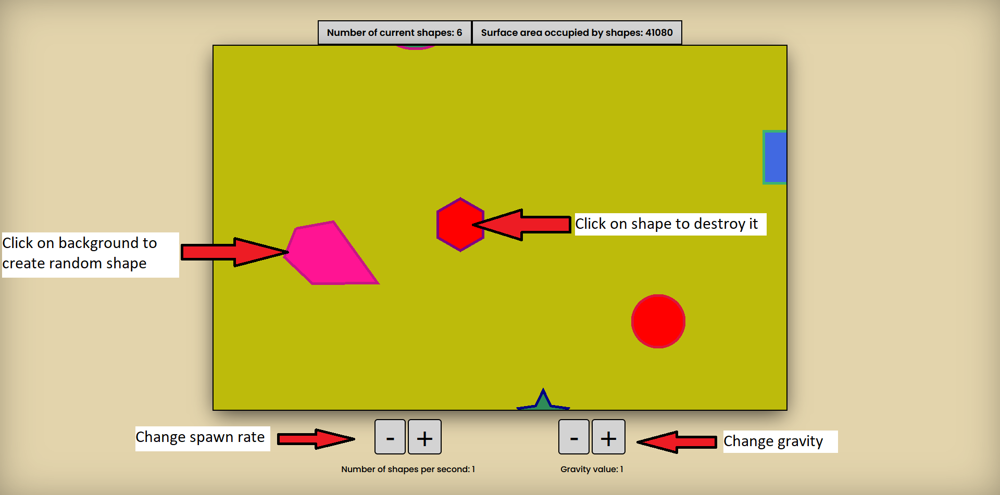

# Falling-Shapes-Game
This is a simple game written on Typescript and using pixi.js

<h2>Run Guide</h2>
<h3>Install</h3>
To install all required dependencies plese run the <code>npm install</code> command in terminal.
<h3>Build & Run</h3>
After all the necessary libraries are installed, run the <code>npm run build</code> command so that the parser builds the application.
After building is finish, open the <code>http://localhost:1234</code> link in your browser.

<h2>App overview</h2>
